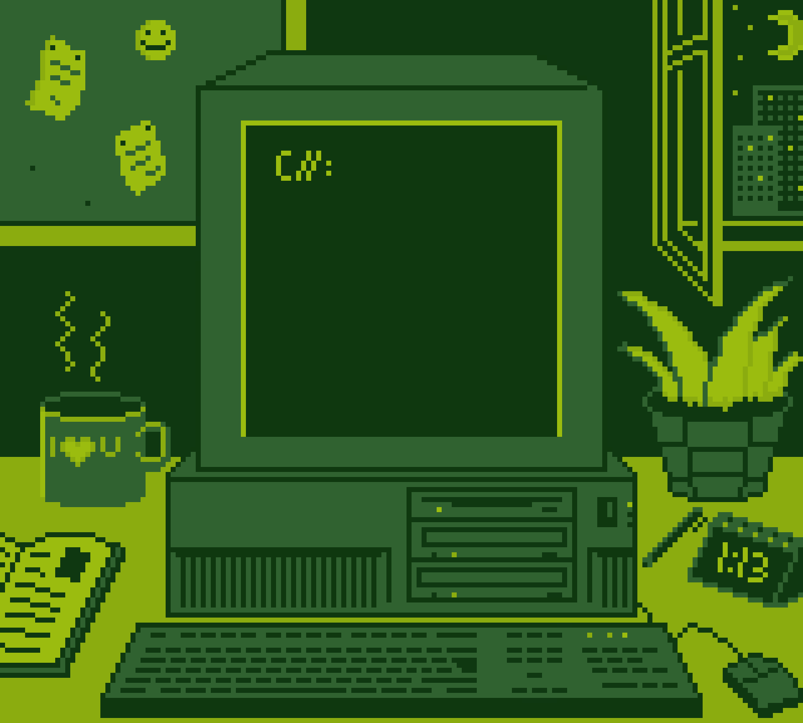

  
   
   
  
   
   
  
  

<table width="100%" align="center">
<tr>
  
<td align="center">
  <a href="https://github.com/eataldasophiazianha?tab=overview&from=2023-03-01&to=2023-03-14">
<strong>Program some things</strong>
 
 
    
 

</a>

</td>
<td align="center">
<a href="https://open.spotify.com/playlist/3lgsqj4rjl9GNHfJ22Fvbp?si=219412afb5044abf">
<strong>Listen to cool music</strong>
 
 

 
</a>

</td>
</tr>
</table>

 
 

 

  
  &nbsp;&nbsp;&nbsp;&nbsp;
  
  &nbsp;&nbsp;&nbsp;&nbsp;
  
   
  
   
   
  
  
  
  
  
  
  

 

 
 
 

 

  

 
</a>

