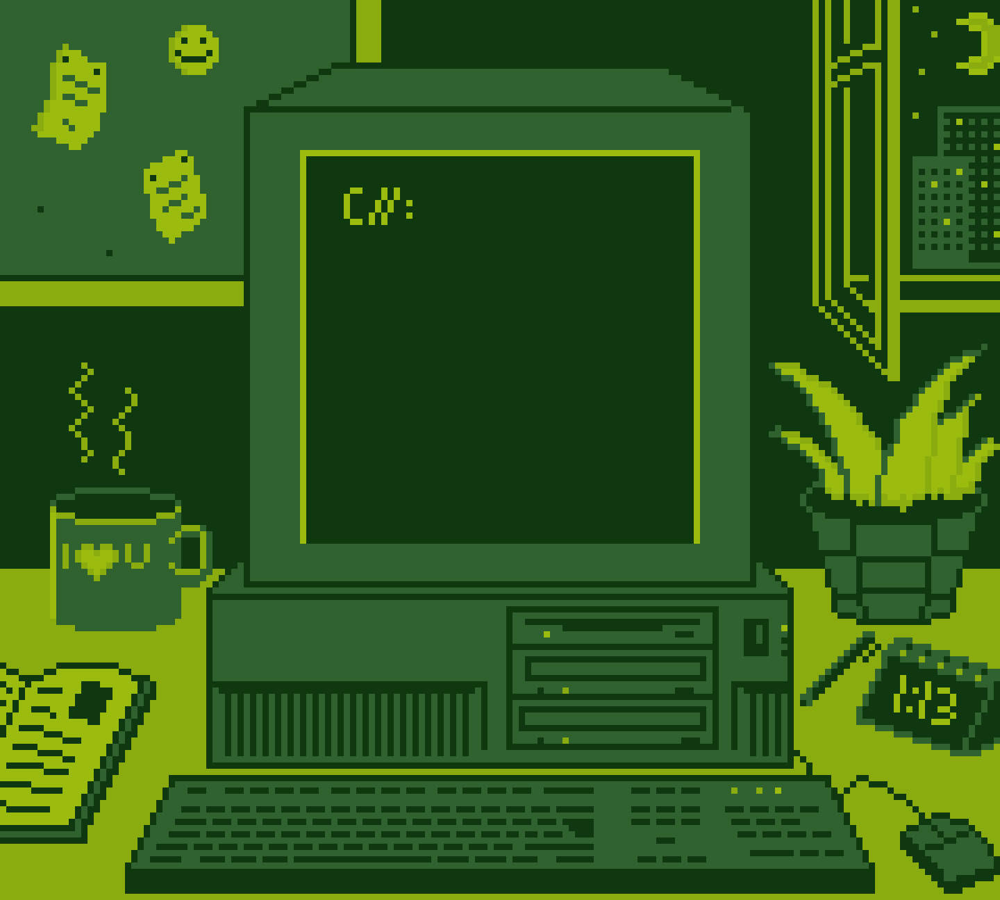

  
   
   
  
   
   
  
  

<table width="100%" align="center">
<tr>
  
<td align="center">
  <a href="https://youtu.be/BBJa32lCaaY?si=bfsL2aIrtkHMceUU">
<strong>Program some things</strong>
 
 
    
 

</a>

</td>
<td align="center">
<a href="https://open.spotify.com/playlist/4Sn82x6JrJJZ1fTNcDq9BI?si=8j0ZtXgASvKdyMVWkCKoBg&pi=u-7qdBvaZAREy_">
<strong>Listen to cool music</strong>
 
 

 
</a>

</td>
</tr>
</table>

 
 

 

 

  
  &nbsp;&nbsp;&nbsp;&nbsp;
  <!--  -->
  <!--   -->
  
  &nbsp;&nbsp;&nbsp;&nbsp;
  
   
   

  
  
  
  
  
  
  
  
  
  
  
  
  
  
  

 
<!-- 

 -->

 

  

 
</a>

